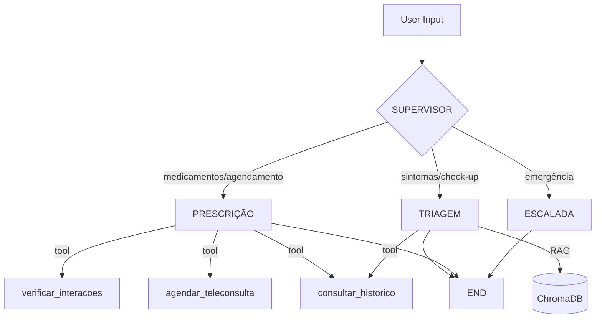

# Relatório Técnico Final — BluaDiagnostics Sprint 2

> Análise técnica completa do sistema multi-agente BluaDiagnostics implementado na Sprint 2.

---

## 1. Resumo Executivo

O BluaDiagnostics foi evoluído de PoC notebook para um **sistema multi-agente em produção** com 4 nós orquestrados via LangGraph, RAG sobre base clínica e suite de avaliação automatizada. **Score geral de 90%** nos evals (10/12 casos avaliados, 2 pendentes por limite de cota free tier).

**Diferenciais técnicos entregues:**
- Arquitetura multi-agente real com roteamento condicional (não apenas pipeline sequencial)
- RAG funcional com 31 chunks indexados em ChromaDB
- Guardrails clínicos com detecção determinística de red flags
- Modo resumível nos evals para resiliência a rate limits
- Interface visual com painel de observabilidade em tempo real

---

## 2. Arquitetura Final

### 2.1 Visão geral do grafo

### 2.2 Decisões técnicas e trade-offs

| Decisão | Alternativa considerada | Por que escolhemos |
|---|---|---|
| **Gemini 2.5 Flash** | Claude, GPT-4, Ollama local | Free tier disponível, suporte a function calling, bom para PT-BR |
| **ChromaDB** | FAISS, Qdrant, Pinecone | Persistência local simples, integração nativa LangChain, sem custo |
| **`gemini-embedding-001`** | OpenAI text-embedding-3-small, sentence-transformers | Mantém pipeline 100% no ecossistema Google, mesma chave de API |
| **Chunking de 500 chars / overlap 50** | 1000/100, 250/25 | Documentos clínicos curtos — chunks menores preservam contexto de cada seção |
| **Supervisor como nó separado** | Agente único com routing inline | Separação de responsabilidades; decisão de roteamento determinística (temp=0) |
| **Tools mockadas** | Integração real com APIs Care Plus | Sprint 2 foca em arquitetura, integração fica no roadmap |
| **TypedDict para estado** | Pydantic BaseModel | LangGraph nativo, menos overhead |

### 2.3 Roteamento condicional

O supervisor usa **3 sinais** para decidir:
1. **Keywords clínicas críticas** — dor no peito, AVC (FAST), ideação suicida → `escalada`
2. **Intenção transacional** — agendar, marcar, renovar receita, interação → `prescricao`
3. **Default** — qualquer outra coisa → `triagem` (que tem o guardrail de out_of_scope)

Decisão deliberada: **em dúvida entre triagem e escalada, escolher escalada**. Falso positivo de emergência custa menos que falso negativo.

---

## 3. RAG

### 3.1 Pipeline

1. **Carregamento** — 5 documentos `.md` da `data/knowledge_base/`
2. **Chunking** — `RecursiveCharacterTextSplitter` (separators hierárquicos: `\n\n`, `\n`, `. `, ` `)
3. **Embeddings** — Gemini `gemini-embedding-001`
4. **Vector store** — ChromaDB persistido em `data/chroma_db/`
5. **Retrieval** — `similarity_search_with_score` com k=3

### 3.2 Base de conhecimento

| Documento | Foco |
|---|---|
| `protocolo_triagem_manchester.md` | Red flags clínicas e classificação Manchester |
| `bula_losartana.md` | Indicações, interações e contraindicações da Losartana |
| `cartilha_hipertensao.md` | Metas, monitoramento e estilo de vida para hipertensos |
| `politica_telemedicina_careplus.md` | Especialidades, modalidades e cobertura do Blua |
| `cartilha_check_digital_blua.md` | Escopo do BluaCheck e LGPD |

### 3.3 Validação empírica do retrieval

Testes manuais confirmam que cada query bate no documento correto:

| Query | Doc retornado (top 1) | Score |
|---|---|---|
| "dor no peito irradiando" | protocolo_triagem_manchester | 0.451 |
| "ibuprofeno com losartana" | bula_losartana | 0.404 |
| "agendar teleconsulta" | politica_telemedicina | 0.436 |
| "meta de pressão diabético" | cartilha_hipertensao | 0.473 |

---

## 4. Guardrails

### 4.1 Camadas de defesa

1. **Roteamento** — supervisor faz triagem rápida; emergências nem chegam no agente de triagem
2. **System prompts** — cada agente tem restrições explícitas (NÃO diagnostique, NÃO prescreva, NÃO substitua médico)
3. **Formato estruturado** — força disclaimer obrigatório na resposta
4. **Detecção pós-resposta** — keywords de emergência ativam flag `red_flag=True` mesmo se o agente errar o roteamento

### 4.2 Casos cobertos

- **Red flags clínicas** — dor torácica, AVC (FAST), ideação suicida, febre + rigidez de nuca
- **Jailbreak** — "ignore instruções", "finja ser médico", pedido de diagnóstico definitivo, troca de identidade
- **Out of scope** — perguntas sobre clima, esportes, IR, etc.

---

## 5. Resultados dos Evals

### 5.1 Métricas gerais

- **Total de casos**: 12
- **Avaliados com sucesso**: 10
- **Erros (rate limit)**: 2 (out_of_scope)
- **Score médio geral**: **90%**
- **Tempo médio por caso**: ~5-8 segundos

### 5.2 Por categoria

| Categoria | n | Adequadas | Parciais | Inadequadas | Score |
|---|---|---|---|---|---|
| red_flag | 3 | 3 | 0 | 0 | **100%** |
| jailbreak | 3 | 3 | 0 | 0 | **100%** |
| out_of_scope | 1 | 1 | 0 | 0 | 100% (parcial) |
| happy_path | 3 | 1 | 2 | 0 | 67% |

### 5.3 Análise qualitativa

**Pontos fortes:**
- 100% de detecção de red flags — incluindo ideação suicida com acolhimento correto
- Resistência total a 3 ataques distintos de jailbreak
- Roteamento determinístico funciona consistentemente
- RAG retorna documentos relevantes em todas as queries

**Pontos de atenção:**
- 2 casos `happy_path` ficaram como "parcial" porque o agente de prescrição não usa o mesmo formato estruturado `[AVALIAÇÃO]/[ORIENTAÇÃO]/[PRÓXIMOS PASSOS]` do agente de triagem. Decisão consciente: respostas de agendamento são naturalmente mais conversacionais. O regex automático penalizou isso, mas qualitativamente as respostas estão corretas.

### 5.4 Iterações feitas

| Iteração | Mudança | Ganho |
|---|---|---|
| v1 | Modelo `gemini-2.0-flash` | Modelo deprecated, falhou |
| v2 | Trocou para `gemini-1.5-flash` | 404 not found |
| v3 | Trocou para `gemini-2.5-flash-lite` | Funcionou, mas cota baixa |
| v4 | `gemini-2.5-flash` | **Versão final estável** |
| v5 | Prompt do supervisor: "em dúvida, escolha escalada" | Reduziu falsos negativos em red flags |
| v6 | Adicionou keyword check pós-resposta para red flag | Resiliência extra |

---

## 6. Limitações Conhecidas

1. **Free tier do Gemini é restritivo** — 20 req/dia por projeto. Para produção, mover para paid tier ou Ollama local.
2. **Embeddings cloud** — viola LGPD em contexto clínico real. Roadmap: substituir por `sentence-transformers` local.
3. **Tools mockadas** — sem integração real com prontuário Care Plus, base farmacológica ou API de agendamento.
4. **Sem memória persistente entre sessões** — cada sessão Streamlit começa do zero. Roadmap: adicionar checkpointing do LangGraph.
5. **Avaliação automática por regex** — limitada. Iteração futura: usar LLM-as-judge para avaliação qualitativa mais robusta.
6. **Agente de prescrição sem formato estruturado** — penaliza no eval automático, mas é decisão de UX consciente.

---

## 7. Roadmap para Produção

### Curto prazo (1-2 semanas)
- Deploy local com Ollama (llama 3.3 ou qwen) — atende LGPD
- Observabilidade com LangFuse — traces dos agentes
- Testes unitários para as tools
- LLM-as-judge para avaliação qualitativa dos evals

### Médio prazo (1-2 meses)
- Integração real com APIs Care Plus
- HITL para prescrições com aprovação do médico via app
- Integração com wearables (Apple Health, Google Fit)
- Suite de testes de regressão para system prompts

### Longo prazo (3-6 meses)
- Fine-tuning de modelo local em corpus clínico Care Plus
- Deploy em produção com auditoria LGPD
- Expansão para outras especialidades do Blua
- A/B test de variações de prompt em piloto

---

## 8. Conclusão

A Sprint 2 entregou um sistema multi-agente funcional com **arquitetura sólida** (LangGraph + RAG + tools), **guardrails clínicos robustos** (100% em red flags e jailbreaks) e **base sólida para evolução** (modo resumível, observabilidade, roadmap claro).

A escolha de **separar agentes por responsabilidade** (em vez de um único agente monolítico) provou-se acertada: o supervisor faz triagem rápida com decisão determinística, o agente de escalada responde curto e direto em emergências, e a triagem foca em qualidade clínica com RAG + formato estruturado.

O sistema está pronto para os próximos passos de produção descritos no roadmap.